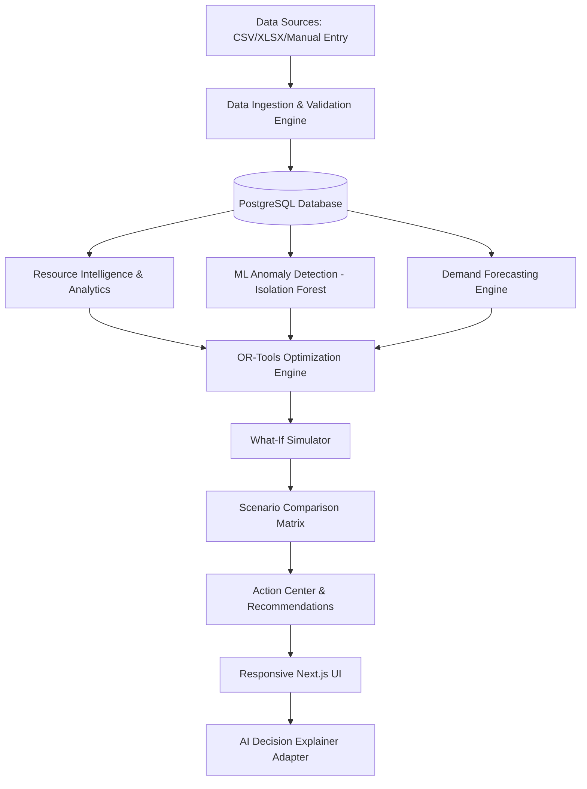

# NEXUS Architecture Documentation

## 1. System Overview
NEXUS is an AI-powered resource intelligence and decision-support platform that transforms complex institutional operational data into actionable, automated decisions.

## 2. Core Architectural Principles
1. **Zero Hardcoded Metrics**: All KPI numbers, anomaly scores, savings projections, and resource allocations are computed dynamically from database rows or mathematical solver outputs.
2. **Pluggable AI Explainer**: LLM integration is decoupled behind an adapter interface. If `OPENAI_API_KEY` is not present, the system defaults to a deterministic, structured analytical explainer that uses actual metric records.
3. **Dual Database Support**: Primary engine targets PostgreSQL with connection pooling. Seamlessly supports local SQLite for rapid testing and standalone demonstration.
4. **Role-Based Access Control (RBAC)**: Enforced both at API route level with FastAPI dependencies and on the frontend with route guards.
